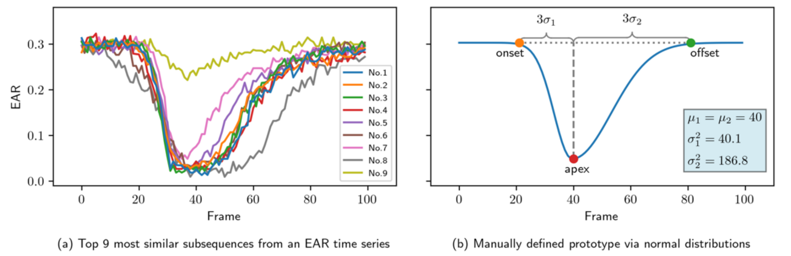

# ESPBM - Eye State Prototype Blink Matching



<p align="center">
  <a href="https://inf-cv.uni-jena.de/home/research/learning3d/facial-paresis-analysis/">[Project Page]</a>
  <a href="https://ebooks.iospress.nl/doi/10.3233/SHTI240731">[Publication]</a>
  <a href="https://pub.inf-cv.uni-jena.de/pdf/xie2024unsupervised.pdf">[PDF]</a>
  <a href="https://www.nature.com/articles/s41598-024-68707-x">[Nature Scientic Reports Work]</a>
</p>

This work presents a novel method for detecting eye blinking by establishing *eye state prototypes* to match blink patterns within the eye aspect ratio (EAR) time series.
In contrast to traditional methods, which mainly focus on the binary ON/OFF of blinks, our method takes care of critical diagnostic details such as blink speed, duration, and inter-eye synchronicity.

In an unsupervised manner, we learned prototypes from the existing blink patterns and established manually defined prototypes.
Our research shows that both *unsupervised learned* and *manually defined prototypes* can reliably detect blink intervals and have comparable results, which offers potential diagnostic tools for identifying muscular or neural disorders.

Under the "minimal working prototype" principle, we aim to establish the eye blink prototype with minimal work, enabling medical professionals without computer expertise to quickly create prototypes to match specific patterns.
This repository presents the source code of our approach and provides a demonstration of sample experiments.

## Getting Started

### Locally

1. Clone the repository

```bash
git clone git@github.com:cvjena/ESPBM.git
```

2. `cd` to ESPBM
3. Create a new conda environment and install the dependencies:

```bash
conda create -n espbm python=3.10 -y
conda activate espbm
# conda install cudatoolkit -y
pip install jupyter
pip install -e .
```

## Via Pip

```bash
pip install espbm
```

## Usage

We provide some example time series and prototypes to demonstrate the usage of our method in the `sample_experiments` folder.
Our code is designed to be modular and flexible, so you can quickly adapt it to your data and prototypes.
We demonstrate the usage of our method in the following steps:

- Data loading
- Prototypes learning or manual definition
- Extraction
- Inter-eye synchronicity

## Citation

```bibtex
@inproceedings{xie2024unsupervised,
  title     = {Unsupervised Learning of Eye State Prototypes for Semantically Rich Blinking Detection},
  author    = {Yuxuan Xie and Tim B{\"u}chner and Lukas Schuhmann and Orlando Guntinas-Lichius and Joachim Denzler},
  booktitle = {Digital Health & Informatics Innovations for Sustainable Health Care Systems},
  year      = {2024},
  month     = august,
  pages     = {1607--1611},
  publisher = {IOS Press},
  series    = {Studies in Health Technology and Informatics},
  volume    = {316},
  code      = {https://github.com/cvjena/ESPBM},
  doi       = {10.3233/SHTI240731},
  groups    = {facialpalsy},
  langid    = {english},
  url       = {https://ebooks.iospress.nl/doi/10.3233/SHTI240731},
  note      = {}
}
```

## License

Licensed under [MIT](License.txt).

## Acknowledgments

Our project is and was only possible with the help of many existing projects and their maintainers and contributors.
We would like to thank the following projects and their maintainers for their work:

- [Stumpy](https://github.com/TDAmeritrade/stumpy) for the unsupervised learning of prototypes and fast pattern-matching
- [JeFaPaTo](https://github.com/cvjena/JeFaPaTo) the extraction of the EAR time series
- [CurlyBrace](https://github.com/iruletheworld/matplotlib-curly-brace) for the nice visualizations of curly braces :)

## Contact

For any queries, requests, or problems, please reach out to

- [Yuxuan Xie](mailto:yuxuan.xie@uni-jena.de)
- [Tim Büchner](mailto:tim.buechner@uni-jena.de)
